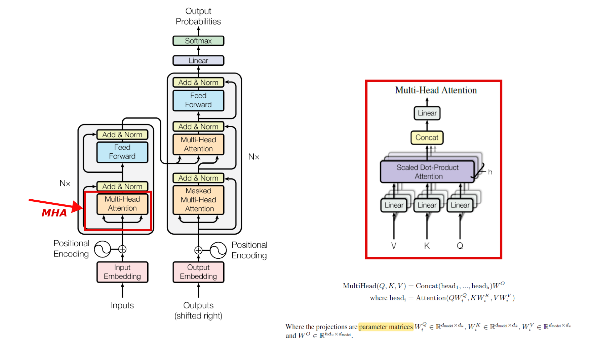
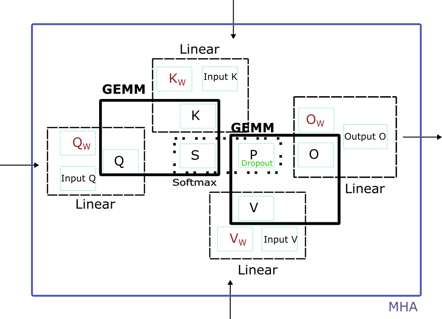

<center></center>
<center>Which part will we implement in the transformer model.</center>

# eigenMHA (eigenDNN vs cuDNN) -- Multi-head Attention Inference and Training implemented by Eigen.
To clone this repo, 
```
git clone --recursive https://github.com/jundaf2/eigenMHA
cd eigenMHA
git clone https://gitlab.com/libeigen/eigen  # clone eigen if necessary
```

## Introduction
 In this repo, we use Eigen3 to implement the forward and backward of Multi-head Attention in Transformer models. Basically, this repo has two branches -- `torch` and `cudnn`. 

## The MHAs in this repo
1. a pytorch MHA in `mha.py` that illustrates the MHA module we implement
2. an eigen MHA in `mha.cc` in both branches (with sources in `./src/eigenDNN.cpp` and headers in `./inlcude/eigenDNN.h`)
3. a libtorch MHA in the `torch` branch as a comparison to the eigenMHA
4. a cudnn MHA in the `cudnn` branch as a comparison to the eigenMHA

### branch `torch`
```
git checkout torch
```

In this branch, the eigenDNN is compared with the CPU libtorch. To make and run the project, first install LibTorch for necessary verification, see https://github.com/jundaf2/dnn-test-framework  [nnTest mainly focuses on providing a testing framework to train and inference Deep Neural Networks using YOUR OWN LIBRARY]. And then,
```
mkdir build && cd build
cmake ..
make -j4
./mha
```


### branch `cudnn`
```
git checkout cudnn
```
In this branch, the eigenDNN is compared with the Multi-head Attention APIs provided by cuDNN V8 (`cudnn_samples_v8/multiHeadAttention`). 

To install cuDNN, see https://developer.nvidia.com/rdp/cudnn-download and https://docs.nvidia.com/deeplearning/cudnn/install-guide/index.html#installlinux-tar . After copying the corresponding libraries and headers to the correct location, 
```
mkdir build && cd build
cmake ..
make -j4
./mha
```

To be more specific, this eigenDNN does what the cuDNN does in the following APIs for MHA operations.
* [cudnnCreateAttnDescriptor()](https://docs.nvidia.com/deeplearning/cudnn/api/index.html#cudnnCreateAttnDescriptor)
* [cudnnSetAttnDescriptor()](https://docs.nvidia.com/deeplearning/cudnn/api/index.html#cudnnSetAttnDescriptor)
* [cudnnGetAttnDescriptor()](https://docs.nvidia.com/deeplearning/cudnn/api/index.html#cudnnGetAttnDescriptor)
* [cudnnSetAttnDescriptor()](https://docs.nvidia.com/deeplearning/cudnn/api/index.html#cudnnSetAttnDescriptor)
* [cudnnDestroyAttnDescriptor()](https://docs.nvidia.com/deeplearning/cudnn/api/index.html#cudnnDestroyAttnDescriptor)
* [cudnnGetMultiHeadAttnBuffers()](https://docs.nvidia.com/deeplearning/cudnn/api/index.html#cudnnGetMultiHeadAttnBuffers)
* [cudnnGetMultiHeadAttnWeights()](https://docs.nvidia.com/deeplearning/cudnn/api/index.html#cudnnGetMultiHeadAttnWeights)
* [cudnnMultiHeadAttnForward()](https://docs.nvidia.com/deeplearning/cudnn/api/index.html#cudnnMultiHeadAttnForward)
* [cudnnMultiHeadAttnBackwardData()](https://docs.nvidia.com/deeplearning/cudnn/api/index.html#cudnnMultiHeadAttnBackwardData)
* [cudnnMultiHeadAttnBackwardWeights()](https://docs.nvidia.com/deeplearning/cudnn/api/index.html#cudnnMultiHeadAttnBackwardWeights)

For more details of the Attention APIs in cuDNN v8, see this [中文CSDN链接](http://t.csdn.cn/Hw0Qi).

## What are the variables of MHA in a Training Library?

<center></center>

### Forward Pass of MHA

1. Q, K, V input embeddings

$$
\mathbf{Q_{in}} \quad  \mathbf{K_{in}} \quad  \mathbf{V_{in}}
$$

2. Weights and bias for the linear layer of Q, K, V, and O.

$$
\mathbf{W_{Q}} \quad \mathbf{b_{Q}}
$$

$$
\mathbf{W_{K}} \quad \mathbf{b_{K}}
$$

$$
\mathbf{W_{V}} \quad \mathbf{b_{V}}
$$

$$
\mathbf{W_{O}} \quad \mathbf{b_{O}}
$$

3. Intermediate variables
4. Output and target

$$
\mathbf{O_{out}}\quad\mathbf{O_{target}}
$$


The equations of MHA forward pass are as follows,

$$
\mathbf{Q} = \mathbf{Q_{in}} \times \mathbf{W_{Q}}+\mathbf{b_{Q}}
$$

$$
\mathbf{K} = \mathbf{K_{in}} \times \mathbf{W_{K}}+\mathbf{b_{K}}
$$

$$
\mathbf{V} = \mathbf{V_{in}} \times \mathbf{W_{V}}+\mathbf{b_{V}}
$$

$$
\mathbf{S} = \mathbf{Q} \times \mathbf{K}^T
$$

$$
\mathbf{P} = SoftmaxFWD(Mask(\mathbf{S} \times \frac{1}{\sqrt{d}}))
$$

$$
\mathbf{P} = DropoutFWD(\mathbf{P})
$$

$$
\mathbf{O}=\mathbf{P}*\mathbf{V}
$$

$$
\mathbf{O_{out}}=\mathbf{O}\times\mathbf{W_{O}}+\mathbf{b_{O}}
$$

### MSE Loss
$$
loss = MSELoss(\mathbf{O_{out}},\mathbf{O_{target}})
$$

MSELoss will also gives the gradient

$$ \mathbf{grad({O_{out}})} $$


### Backward Pass of MHA

1. Gradients for output (from LayerNorm)

$$
\mathbf{grad({O_{out}})}
$$

2. Gradients for the intermediate variables
3. Gradients for the forward input

$$ 
\mathbf{grad({Q_{in}})} \quad \mathbf{grad({K_{in}})} \quad \mathbf{grad({V_{in}})}
$$

4. Gradients of the weights and biases

$$
\mathbf{grad({W_{Q}})} \quad \mathbf{grad({b_{Q}})}
$$

$$
\mathbf{grad({W_{K}})} \quad \mathbf{grad({b_{K}})}
$$

$$
\mathbf{grad({W_{V}})} \quad \mathbf{grad({b_{V}})}
$$

$$
\mathbf{grad({W_{O}})} \quad \mathbf{grad({b_{O}})}
$$

The equations of MHA backward pass are as follows,

$$
\mathbf{grad\\_O} = \mathbf{grad\\_O}_{out}*\mathbf{W}_{O}
$$

$$
\mathbf{grad\\_W}_{O} = \mathbf{grad\\_O}_{out}^T*\mathbf{O}
$$

$$
\mathbf{grad\\_b}_{O} = colsum(\mathbf{grad\\_O}_{out})
$$

$$
\mathbf{grad\\_P} = \mathbf{grad\\_O}*\mathbf{V}^T
$$

$$
\mathbf{grad\\_V} = \mathbf{P}^T*\mathbf{grad\\_O}
$$

$$
\mathbf{grad\\_P} = DropoutBWD(\mathbf{grad\\_P})
$$

$$
\mathbf{grad\\_S} = SoftmaxBWD(\mathbf{P},\mathbf{grad\\_P})*\frac{1}{\sqrt{d}}
$$

$$
\mathbf{grad\\_Q} = \mathbf{grad\\_S}*\mathbf{K}
$$

$$
\mathbf{grad\\_K} = \mathbf{grad\\_S}^T*\mathbf{Q}
$$

$$
\mathbf{grad\\_Q}_{in} = \mathbf{grad\\_Q}*\mathbf{W}_{Q}^T
$$

$$
\mathbf{grad\\_W}_{Q} = \mathbf{Q}_{in}^T*\mathbf{grad\\_Q}
$$

$$
\mathbf{grad\\_b}_{Q} = colsum(\mathbf{grad\\_Q})
$$

$$
\mathbf{grad\\_K}_{in} = \mathbf{grad\\_K}*\mathbf{W}_{K}^T
$$

$$
\mathbf{grad\\_W}_{K} = \mathbf{K}_{in}^T*\mathbf{grad\\_K}
$$

$$
\mathbf{grad\\_b}_{K} = colsum(\mathbf{grad\\_K})
$$

$$
\mathbf{grad\\_V}_{in} = \mathbf{grad\\_V}*\mathbf{W}_{V}^T
$$

$$
\mathbf{grad\\_W}_{V} = \mathbf{V}_{in}^T*\mathbf{grad\\_V}
$$

$$
\mathbf{grad\\_b}_{V} = colsum(\mathbf{grad\\_V})
$$

  
## The components of the MHA Training Library
### MSE Loss Function

Loss function, as the origin of DL system, is a basic component inside a DL system.

<center></center>
<center> MSE Loss.</center>


```
eidnnStatus_t eidnnMSELoss(
    eidnnHandle_t handle,
    const Tensor<float, 3> &output, 
    const Tensor<float, 3> &target,
    Tensor<float, 0> &loss,
    Tensor<float, 3> &d_loss);
```

### Linear
cuDNN has no specific APIs for linear layer.

In eigenDNN, we have

```
eidnnStatus_t eidnnLinearForward(eidnnHandle_t handle,
                    const Tensor<float, 3>& x, // data
                    const Tensor<float, 2>& w, // weight
                    const Tensor<float, 1>& bias, // bias
                    Tensor<float, 3>& y);
```

```
eidnnStatus_t eidnnLinearBackward(eidnnHandle_t handle,
                     const Tensor<float, 3>& dy,
                     const Tensor<float, 3>& x,
                     const Tensor<float, 2>& w,
                     Tensor<float, 3>& dx, // gradient of input data
                     Tensor<float, 2>& dw, // accumulated gradient of weight
                     Tensor<float, 1>& dbias // accumulated gradient of bias
                     );
```

### MatMul

$$ C = \beta * C + \alpha*Op_c(MatMul(Op_a(A),Op_b(B))) $$

, where $Op_m(M)$ is whether to transpose matrix $M$ or not in the forward pass.

cuDNN has no specific APIs for matrix-multiply operation.

In eigenDNN, we have

```
eidnnStatus_t eidnnStridedBatchedGemmForward(
    eidnnHandle_t handle,
    float alpha,
    float beta,
    bool trans_A, // Op_a
    bool trans_B, // Op_b
    bool trans_C, // Op_c
    const Tensor<float, 4> &A, 
    const Tensor<float, 4> &B, 
    Tensor<float, 4> &C);
```

```
eidnnStatus_t eidnnStridedBatchedGemmBackward(
    eidnnHandle_t handle,
    float alpha,
    float beta,
    bool trans_A, // Op_a
    bool trans_B, // Op_b
    bool trans_C, // Op_c
    const Tensor<float, 4> &A, // A
    const Tensor<float, 4> &B, // B
    const Tensor<float, 4> &d_C, // gradient of C
    Tensor<float, 4> &d_A, // gradient of A
    Tensor<float, 4> &d_B // gradient of B
    );
```
### Softmax
cuDNN has the following APIs for softmax operation.
* [cudnnSoftmaxForward()](https://docs.nvidia.com/deeplearning/cudnn/api/index.html#cudnnSoftmaxForward)
* [cudnnSoftmaxBackward()](https://docs.nvidia.com/deeplearning/cudnn/api/index.html#cudnnSoftmaxBackward)

In eigenDNN, we have

```
eidnnStatus_t eidnnSoftmaxForward(eidnnHandle_t handle,
                    eidnnSoftmaxAlgorithm_t algo,
                    eidnnSoftmaxMode_t mode,
                    const Tensor<float, 4>& x,
                    Tensor<float, 4>& y);
```

```
eidnnStatus_t eidnnSoftmaxBackward(eidnnHandle_t handle,
                     eidnnSoftmaxAlgorithm_t algo,
                     eidnnSoftmaxMode_t mode,
                     const Tensor<float, 4>& y,
                     const Tensor<float, 4>& dy,
                     Tensor<float, 4>& dx);
```

### Dropout
cuDNN has the following APIs for dropout operation.
* [cudnnCreateDropoutDescriptor()]()
* [cudnnDestroyDropoutDescriptor()]()
* [cudnnDropoutGetStatesSize()]()
* [cudnnDropoutGetReserveSpaceSize()]()
* [cudnnDropoutForward()]()
* [cudnnGetDropoutDescriptor()]()
* [cudnnRestoreDropoutDescriptor()]()
* [cudnnSetDropoutDescriptor()]()
* [cudnnDropoutBackward()]()

In eigenDNN, we have

```
// dropout rate, 
// pointer to memory space of states (allocated by forward pass), 
// size of memory space in bytes (calculated by forward pass), 
// random seed
using eidnnDropoutDescriptor_t = std::tuple<float, void*, size_t, unsigned long long>; 
```
```
eidnnStatus_t eidnnDropoutForward(
    eidnnHandle_t                       handle,
    eidnnDropoutDescriptor_t      &dropoutDesc,
    const Tensor<float, 4>         &x, // input data
    Tensor<float, 4>               &y // input data after dropout
    );
```

```
eidnnStatus_t eidnnDropoutBackward(
    eidnnHandle_t                   handle,
    const eidnnDropoutDescriptor_t  dropoutDesc,
    const Tensor<float, 4>       &dy, // gradient of dropout output data
    Tensor<float, 4>             &dx // gradient of dropout input data
    );
```
